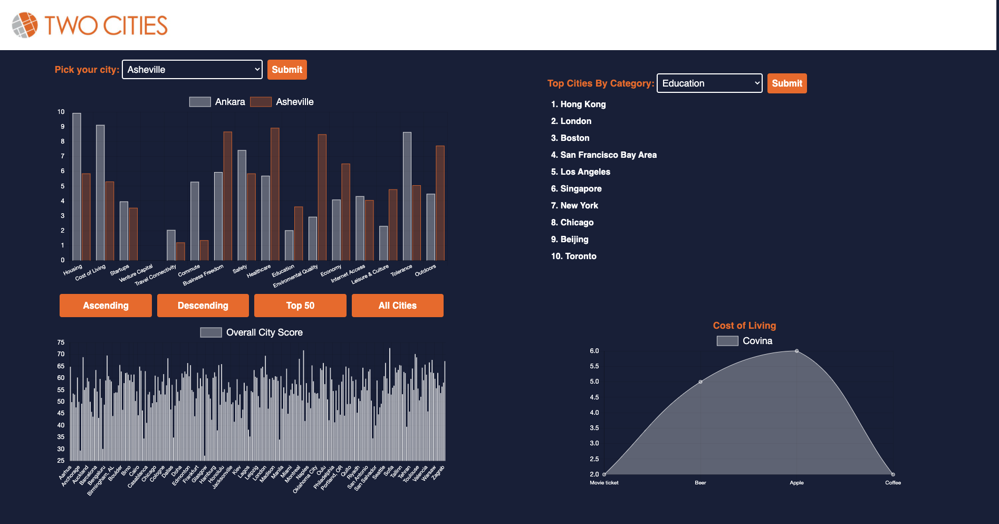

# Two Cities

> Web service allowing users to compare cities based on an avg score along with different categories including: Housing, Startups, Transportation, Economy, Cost of Living, Education, Safety , etc



## Usage

> Display two bar charts, one comparing multiple cities with categories listed above. Second chart shows all cities and is sortable based on scores or alphabetically

## Requirements


- Node 6.13.0
- Webpack

### Installing Dependencies

From within the root directory:

```sh
npm install
npm run seed
npm run build
npm run start
```

### PageSpeed Increase and Initial deployment using Docker


#### Task 1: Deploy using Amazon EC2 and Docker
- Used two separate containers one with the application and one for the latest mongo build
apt install docker.io
docker pull mongo:latest
docker run -d --name mongo mongo:latest

- Pull down Docker Container from DockerHub
docker pull dflores112/twocities:initial
- Inspect which port Mongo is running on: 
docker inspect bridge

- Change where the database connects to:

Previous :
mongoose.connect('mongodb://localhost/CityScoresDB', { useNewUrlParser: true, useUnifiedTopology: true });
 
After change:
mongoose.connect('mongodb://172.17.0.3:27017/CityScoresDB', { useNewUrlParser: true, useUnifiedTopology: true });

- Once you are connected process seeding script:
docker exec -it *container-anem /bin/bash
Npm run seed
Control + d

- Once seeded spin up a container from the docker image pulled down
docker run -d -p 80:3000 --name *container-name --rm dflores112/twocities:initial

#### Task 2: Initial Render and insights using Google page speeds:


- Opportunities for improvement:


#### Task 3: First change made to try and serve up the bundle.js from S3 
- Went into S3 and created a new bucket for TwoCities and allowed items to be public
- Uploaded Bundle.js to S3
- Vim into index.html using docker exec command and changed the source to come from S3 object url
**Google Page Speed:**

- Mobile


- Desktop


- Found this cool webpack visualizer that allowed you to hover over different aspects of Webpack which I will now add along with Google Page Speeds.

#### Task 4: Changed the node env to reduce the size of React’s vendor by using production settings, which would remove all the development oriented warnings and overhead

- https://facebook.github.io/react/docs/optimizing-performance.html
- plugins: [ new webpack.DefinePlugin({   'process.env.NODE_ENV': JSON.stringify('production') })]
- The first thing I notice after rebuilding the bundle.js is the size of the bundle compared to before the plugin. The size before adding plugin is 6.6 MB - after implementing plugin the bundle size 4MB


- Mobile went from 7 to 8

**- First Contentful Paint Before: 36.4s
**

**- First Contentful Paint After: 23s
**

- Desktop went from 25 to 41
- First Contentful Paint Before: 6.1s
- First Contentful Paint After: 4s

- Still in the red but biggest increase so far
- Google says text based resources should be served with compression GZIP
- Serve static assets with an efficient cache policy
- Can speed up repeats site visits


- Room for improvement


#### Task 5: Next step is use the built in UglifyJSplugin. Minification of the .js output starts with built-in UglifyJsPlugin. There’s also an option to use identifiers instead of module names to minimize the output a bit more evoked using HashedModuleIdsPlugin (NamedModulesPlugin is recommended for development).

- Webpack only .1 M smaller - not much changed here.


